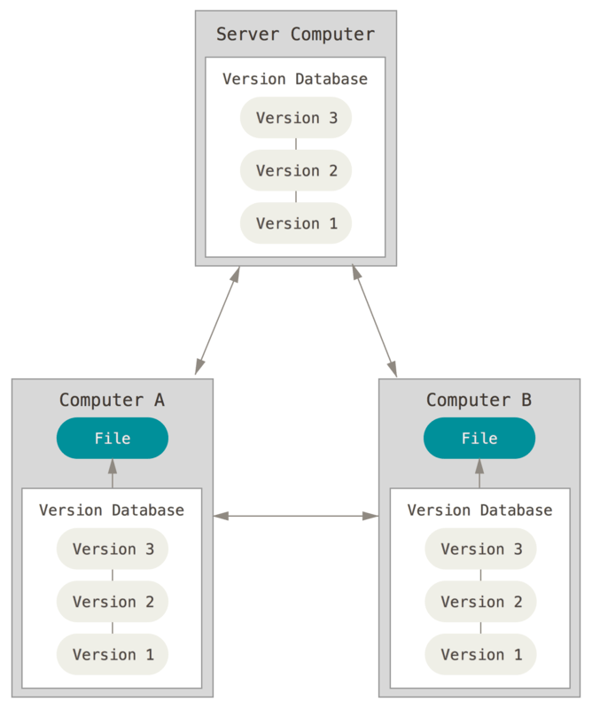

## About systems Version Control

### "What is version control and why is it needed?"

Version control is a system that helps track changes in files over time.
Imagine you're working on a project — whether it's code, a document, or even a design.
You make changes, add new features, or fix bugs, but then realize something went wrong
and you need to revert to a previous version. Without a version control system, this would be extremely difficult.

Version control allows you to save the history of all changes. You can return to an earlier version of a file at any time,
compare different versions, or even undo changes if they turned out to be mistakes.
This is especially useful when several people are working on a project. Each team member can make changes
without the fear of losing important data or creating confusion.

In addition, version control systems help organize the workflow on a project.
You can create "branches" to experiment with new ideas without affecting the main version of the project.
Once the experiment is complete, the changes can be merged with the main version.

In today’s world, where projects are becoming more complex and teams larger, version control has become an essential tool
for developers, designers, and even writers.

---

## Git

### Git: Why has it become the standard for developers?"

Git is one of the most popular version control systems used by developers around the world.
Created by Linus Torvalds (the creator of Linux), Git has become the standard for managing code and projects.
But what makes it so popular?

First of all, Git allows you to save the entire history of changes in a project. Every time you make changes,
you create a "commit" that records the current state of the files. If something goes wrong,
you can always go back to any of the previous commits.

Secondly, Git supports branches. Branches allow you to experiment with new ideas without affecting the main codebase.
For example, you can create a separate branch to develop a new feature, and when it’s ready,
merge it into the main version of the project.

Another advantage of Git is its support for teamwork. Multiple developers can make changes to the same project at the same time,
and Git automatically tracks these changes and helps resolve conflicts if they occur.

Git also integrates with collaboration platforms like GitHub, GitLab, and Bitbucket.
These platforms allow you to store code in the cloud, share it with other developers, and track tasks.

If you're just getting started with Git, begin with the basic commands:

- __git init__ - initialize a new repository.

- __git add__ - add files to be tracked.

- __git commit__ - save changes.

- __git push__ - upload changes to a remote server.

Git is a powerful tool that simplifies project work, saves time, and helps avoid mistakes.
If you’re not using Git yet, now’s the perfect time to start!
