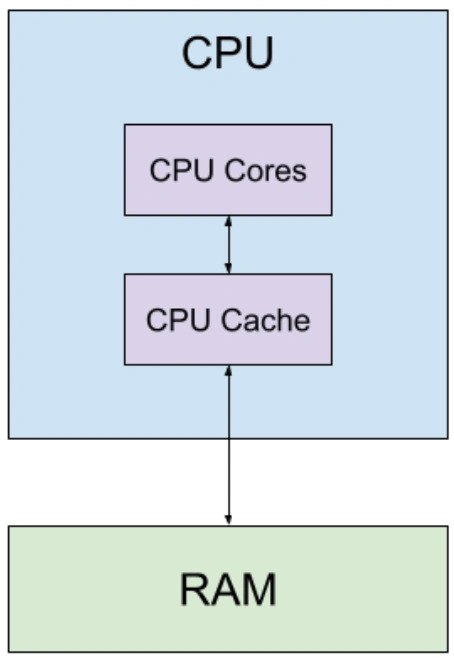

## The Role of C in Scientific Programming

Despite the popularity of modern languages like Python and Julia,
C still holds a special place in scientific computing. It offers maximum performance and control - and in tasks where every fraction of a second matters, that’s a critical factor.
C allows direct work with memory and hardware, making it the ideal choice for computational physics, climate modeling, simulations, and other resource-heavy fields.
Many of the most important libraries - like __BLAS, LAPACK, and FFTW__ - are still written in C (or Fortran), because even small performance improvements can make a huge difference.

C is also heavily used in embedded and real-time systems, for example in medical devices or scientific instruments, where precision, predictability, and minimal overhead are essential.
Even Python relies on C under the hood: libraries like NumPy and SciPy are built on C extensions.
And languages like Rust or Julia easily call C functions when maximum performance is required.

Of course, C has its downsides - manual memory management can lead to errors, and multithreading often requires working with libraries like pthreads or OpenMP.
But when the task is truly heavy - whether it’s simulating a galaxy or optimizing deep neural network layers — C is still unmatched.
Understanding C helps you see how computation works under the hood.
And even if you mostly write in more modern languages, knowing C is like having a good knife:
you may not use it every day, but when you need it - nothing beats it.
