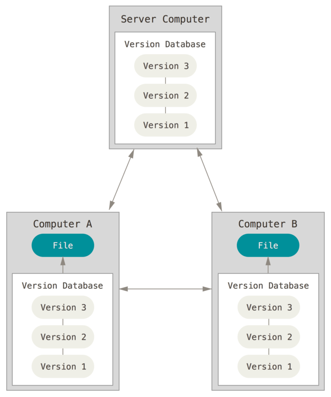

## О системе управления версиями

### "Что такое управление версиями и зачем оно нужно?"

Управление версиями — это система, которая помогает отслеживать изменения в файлах с течением времени.
Представьте, что вы работаете над проектом — будь то код, документ или даже дизайн.
Вы вносите изменения, добавляете новые функции или исправляете ошибки, но вдруг понимаете, что что-то пошло не так,
и нужно вернуться к предыдущей версии. Без системы управления версиями это было бы крайне сложно.

Управление версиями позволяет сохранять историю всех изменений. Вы можете в любой момент вернуться к более ранней версии файла,
сравнить разные версии между собой или даже отменить изменения, если они оказались ошибочными.
Это особенно полезно, когда над проектом работает несколько человек. Каждый участник может вносить свои изменения,
не боясь потерять важные данные или создать путаницу.

Кроме того, системы управления версиями помогают организовать работу над проектом.
Вы можете создавать "ветки" (branches) для экспериментов с новыми идеями, не затрагивая основную версию проекта.
Когда эксперимент завершен, изменения можно объединить с основной версией.

В современном мире, где проекты становятся всё сложнее, а команды — больше, управление версиями стало необходимым инструментом
для разработчиков, дизайнеров и даже писателей.

## Git

### Git: почему он стал стандартом для разработчиков?"

Git — это одна из самых популярных систем управления версиями, которая используется разработчиками по всему миру.
Созданный Линусом Торвальдсом (автором Linux), Git стал стандартом для управления кодом и проектами.
Но что делает его таким популярным?

Во-первых, Git позволяет сохранять историю всех изменений в проекте. Каждый раз, когда вы вносите изменения,
вы создаете "коммит" (commit), который фиксирует текущее состояние файлов. Если что-то пойдет не так,
вы всегда можете вернуться к любому из предыдущих коммитов.

Во-вторых, Git поддерживает ветки (branches). Ветки позволяют вам экспериментировать с новыми идеями, не затрагивая основной код.
Например, вы можете создать отдельную ветку для разработки новой функции, а когда она будет готова,
объединить её с основной версией проекта.

Еще одно преимущество Git — это возможность работать в команде. Несколько разработчиков могут одновременно вносить изменения в один
и тот же проект, а Git автоматически отслеживает эти изменения и помогает разрешать конфликты, если они возникают.

Git также интегрируется с платформами для совместной работы, такими как GitHub, GitLab и Bitbucket.
Эти платформы позволяют хранить код в облаке, делиться им с другими разработчиками и отслеживать задачи.

Если вы только начинаете работать с Git, начните с базовых команд:

1. git init — создание нового репозитория.

2. git add — добавление файлов для отслеживания.

3. git commit — сохранение изменений.

4. git push — отправка изменений на удаленный сервер.

Git — это мощный инструмент, который упрощает работу над проектами, экономит время и помогает избежать ошибок.
Если вы еще не используете Git, самое время начать!
